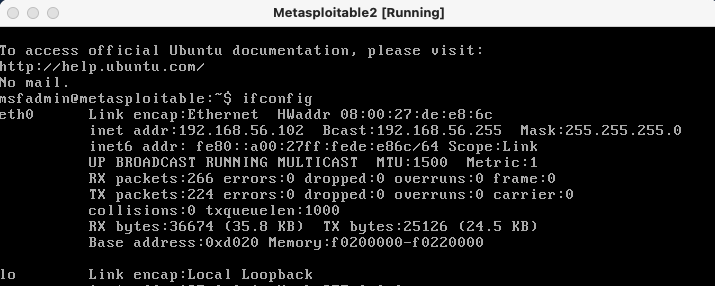
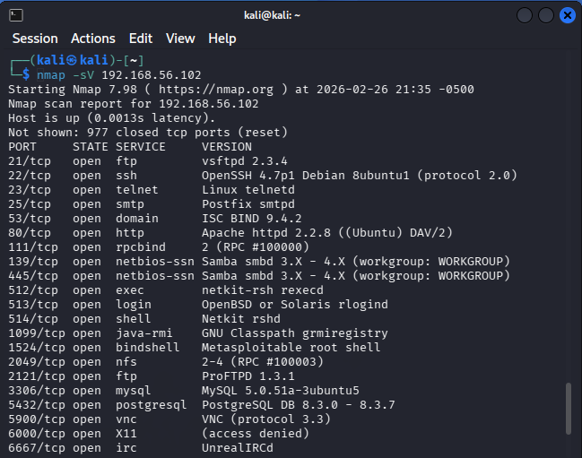
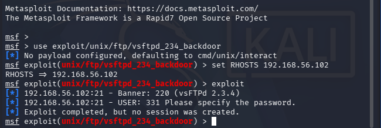

# Home Cybersecurity Lab – Vulnerability Exploitation Project

## Skills Demonstrated

- Network reconnaissance using Nmap
- Vulnerability research using Searchsploit
- Exploit execution using Metasploit Framework
- Linux command-line operations
- Privilege validation and root access confirmation
- Risk impact analysis
- Security documentation and reporting

---

## Overview
I built an isolated cybersecurity lab using VirtualBox with an attacker machine (Kali Linux) and a vulnerable target system (Metasploitable2).

The goal was to simulate a real-world security assessment by performing reconnaissance, identifying vulnerabilities, exploiting a known weakness, and validating system compromise.

---

## Lab Environment
- Host Machine: macOS
- Hypervisor: Oracle VirtualBox
- Attacker System: Kali Linux
- Target System: Metasploitable2
- Network: Host-Only Adapter (isolated lab)

---

## Assessment Process

### 1. Target Verification
Confirmed network connectivity between attacker and target machines.

### 2. Service Enumeration
Used Nmap to identify open ports and running services.

### 3. Vulnerability Identification
Discovered vulnerable FTP service running VSFTPD 2.3.4.

### 4. Exploitation
Used Metasploit Framework to exploit the VSFTPD backdoor vulnerability.

### 5. Post-Exploitation Validation
Achieved root-level access and verified full system compromise.

---

## Evidence Screenshots

### 1. Lab Setup

### 2. Target IP Verification

### 3. Nmap Service Enumeration

### 4. Vulnerability Identification

### 5. Metasploit Module Discovery

### 6. Exploit Attempt Execution

### 7. Successful Remote Exploitation

### 8. Root Access Proof

---

## Report
Full vulnerability assessment report:

Home_Cybersecurity_Lab_Report_Watermarked_Korbin_Cartwright.pdf

---

## Key Takeaways
- Demonstrated end-to-end penetration testing workflow
- Validated impact of unpatched services
- Documented remediation recommendations
